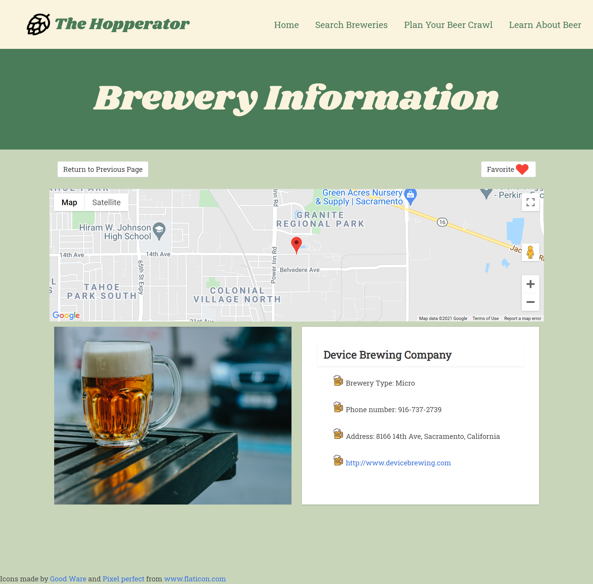
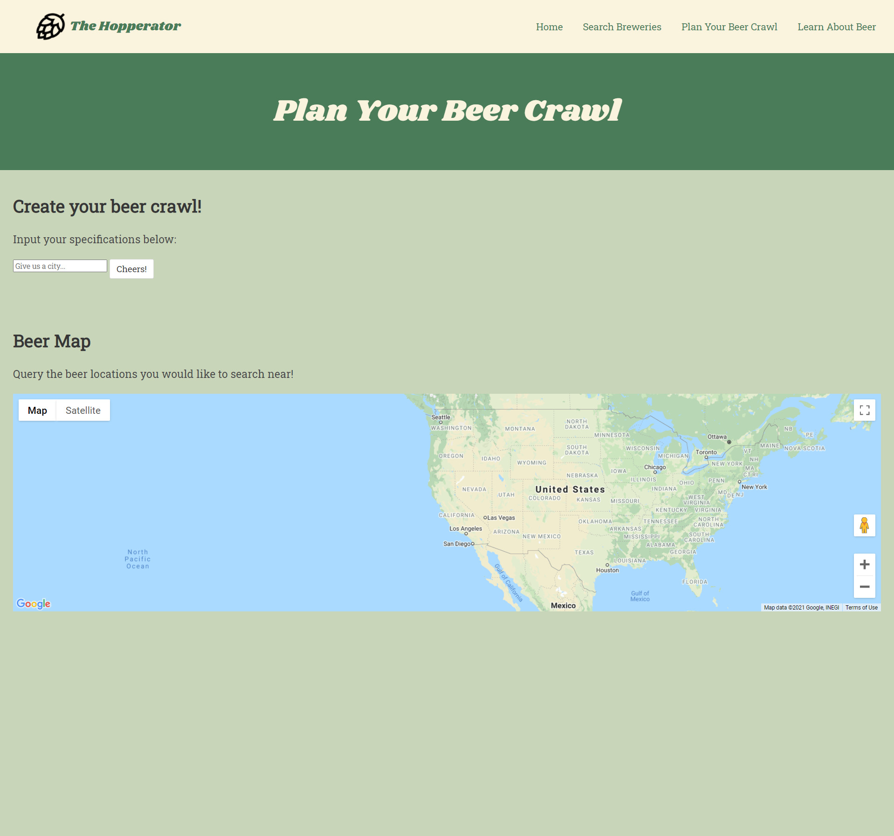

# The Hopperator: You Place for All Things Beer

## Description

The Hoppeator is your one-stop shop to explore the world of beer. Our homepage features a short history of beer and we have pages to learn about the types of beer, search breweries and plan your beer crawl. You can save your favorite breweries and access them using the 'Favorites' page.

## Technologies Used

* HTML, CSS and Javascript
* Bulma CSS library
* Open Brewery DB API
* Google Maps API

## Link to Deploy

[The Hopperator: Your Place for All Things Beer](https://fransandoval093.github.io/Hopperator/)

## Screenshots

